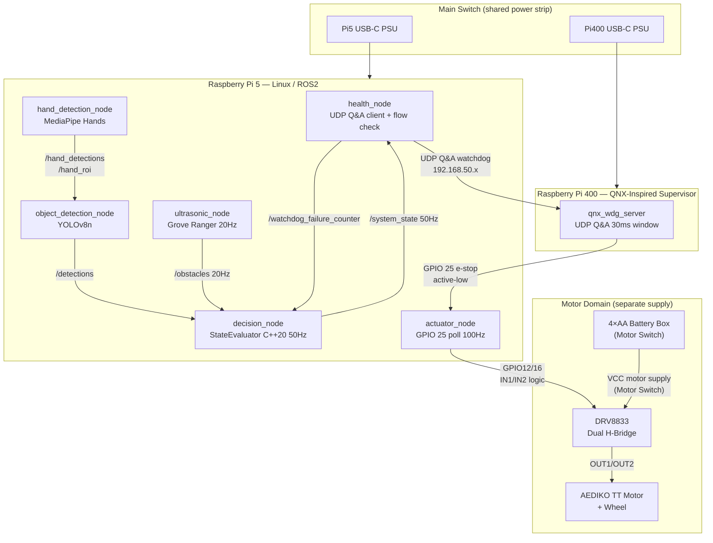

# Safety-Supervised Edge AI Demo — Raspberry Pi 5 + Pi 400

A dual-processor **ASIL-B-inspired** edge AI safety demonstrator implementing Freedom from
Interference (FFI) architectural measures, deterministic safety supervision, and sensor
fusion across heterogeneous compute platforms.

> **Educational demonstrator only — NOT ISO 26262 certified — NOT production-ready.**
> ASIL-B-inspired patterns. No LLM or cloud AI in the runtime safety path.

---

## What This Demonstrates

| Capability | Implementation |
|---|---|
| Dual-processor FFI architecture | Pi5 (Linux/ROS2) + Pi400 (QNX-inspired supervisor) |
| AI perception with safety supervision | MediaPipe Hands + YOLOv8n, monitored by deterministic rule-based logic |
| Q&A external watchdog | UDP challenge/response, 30ms window, CRC-16 + sequence counter (E2E) |
| Hardware e-stop | GPIO 25 direct wire Pi400→Pi5, active-low, fail-safe at boot |
| Deterministic state machine | C++20 StateEvaluator, 5 states, 27 gtest unit tests |
| Sensor fusion | Ultrasonic + camera distance estimation (pinhole model) |
| MMU spatial isolation | MediaPipe and YOLOv8n in separate Linux processes |
| Program flow check | health_node monitors pipeline liveness, gates watchdog servicing |
| Fault injection verified | 5 scenarios tested (M6) |
| FFI verification | 3 interference tests under stress (M7) |

---

## Hardware

| Component | Role |
|---|---|
| Raspberry Pi 5 (8 GB) | Linux/ROS2 domain — AI perception, state machine |
| Raspberry Pi 400 | QNX-inspired supervisor — watchdog server, hardware e-stop |
| Raspberry Pi Camera Module 3 (IMX708) | Hand and object detection |
| Grove Ultrasonic Ranger (GPIO 23) | Precise proximity measurement (2–350 cm) |
| Traffic-light LED module (GPIO 17/27/22) | System state indicators |
| Active buzzer (GPIO 18) | Audible alerts |
| DRV8833 dual H-bridge motor driver | Controls AEDIKO TT DC gear motor — visible actuator demonstrator |
| AEDIKO TT DC gear motor with wheel | Visualises velocity scaling and safe-state stop behaviour |
| 4×AA battery box with switch | Dedicated motor supply (Motor Switch) — isolated from Raspberry Pi power |

**Inter-processor wiring:**
- UDP Q&A watchdog over dedicated Ethernet `192.168.50.10 ↔ 192.168.50.20`
- E-stop: Pi400 GPIO 25 → Pi5 GPIO 25 (active-low direct wire)
- Red LED: wired-OR via 1N4148 diodes (both sides can assert independently)

**Motor actuator wiring:**
- Pi5 GPIO 12 (Pin 32) → DRV8833 IN1; Pi5 GPIO 16 (Pin 36) → DRV8833 IN2
- 4×AA battery positive → DRV8833 VCC (via Motor Switch); battery negative → DRV8833 GND
- Pi5 GND (Pin 34 or 39) → DRV8833 GND (common ground — mandatory)
- DRV8833 OUT1/OUT2 → AEDIKO TT motor terminals

---

## Current Hardware Concept

### Main Switch (shared power strip)

Both the Raspberry Pi 5 and Raspberry Pi 400 are powered through the **same power strip**,
controlled by one **Main Switch**.

- **Main Switch ON** → Pi5 boots (Linux/ROS2), Pi400 boots (supervisor/watchdog).
- **Main Switch OFF** → both processors power off simultaneously.
- The Main Switch is not a software-controlled signal — it is a physical hardware switch on
  the shared power strip.

### Motor Switch (4×AA battery box)

The DRV8833 motor driver and AEDIKO TT motor are powered **separately** from a 4×AA battery
box. The battery box has its own switch — the **Motor Switch**.

- **Motor Switch ON** → motor supply is available to DRV8833 VCC.
- **Motor Switch OFF** → motor supply is removed; motor cannot rotate regardless of software.
- Raspberry Pi GPIO pins drive only the DRV8833 **logic inputs** (IN1/IN2) — never the motor
  supply rail.
- Pi GND, 4×AA battery negative, and DRV8833 GND are **all connected together** (common
  ground reference — mandatory for correct logic levels).

> ⚠️ **Safety note**: Never connect the 4×AA battery positive to any Raspberry Pi GPIO pin.
> GPIO pins are 3.3 V logic only and cannot withstand motor supply voltages.

### Startup and Operating Concept

The Main Switch powers both processors through a shared power strip. After boot, the system is
released to NORMAL only if the application nodes, sensor validity checks and watchdog supervision
are all healthy. The motor actuator is powered separately by a 4×AA battery box through a Motor
Switch and controlled by the Pi5 through a DRV8833 driver. The motor represents a simplified
robot actuator and is used to visualise velocity scaling and safe-state stop behaviour.

**Boot sequence (Main Switch ON):**
1. Pi400 boots, asserts e-stop GPIO 25 LOW (fail-safe), red LED ON.
2. Pi5 boots, ROS2 nodes start; motor command defaults to `velocity_scale = 0.0`.
3. health_node begins UDP Q&A watchdog exchange with Pi400 supervisor.
4. Once Q&A watchdog is healthy, sensors are valid and all nodes are alive → system enters NORMAL.
5. Pi400 releases e-stop (GPIO 25 HIGH), green LED ON.
6. In NORMAL with Motor Switch ON: motor rotates at `velocity_scale = 1.0`.

**If startup criteria are not met**, the system remains in SAFE_STATE.
No auto-release. Manual `/reset` required after fault conditions are cleared.

### Visible Actuator Demonstration with DRV8833 and TT Motor

The DRV8833 module ([Amazon DE B076KFRJWL](https://www.amazon.de/dp/B076KFRJWL)) drives one
AEDIKO TT DC gear motor with wheel. This is used solely as a **visible actuator** to demonstrate
`velocity_scale` behaviour and safe-state stop — not as a safety-certified actuator.

| System State | velocity_scale | Motor behaviour (Motor Switch ON) |
|---|---|---|
| BOOTING / INIT | 0.0 | Motor off — default at boot |
| NORMAL | 1.0 | Motor rotates at full speed |
| WARNING (obstacle in warning range) | 0.5 | Motor rotates at reduced speed |
| SAFE_STATE (near range / watchdog fault / init fail) | 0.0 | Motor stopped |

Safe State has priority over any velocity command. If SAFE_STATE is requested due to near-range
detection, watchdog fault, invalid startup release or critical monitoring fault, the actuator
command shall force `velocity_scale` to `0.0` and the red LED shall be activated.

---

## Architecture



### State Machine

```
INIT → NORMAL → WARNING (obstacle <0.50m)
                       ↓
             DEGRADED (one sensor lost)
                       ↓
             SAFE_STATE ← watchdog failure OR
                          ultrasonic <0.15m OR
                          camera hand <0.20m OR
                          both sensors invalid
                       ↓
                  manual /reset
```

| State | vel_scale | Green LED | Yellow LED | Red LED |
|---|---|---|---|---|
| INIT | 0% | ON (init) | OFF | OFF |
| NORMAL | 100% | ON | OFF | OFF |
| WARNING | 20% | OFF | ON | OFF |
| DEGRADED | 20% | OFF | ON | OFF |
| SAFE_STATE | 0% | OFF | OFF | ON |

---

## Getting Started

### Prerequisites (Pi5)

```bash
# ROS2 Humble (built from source on RPi OS Bookworm)
source ~/ros2_humble/install/setup.bash

# Python dependencies
sudo apt install python3-picamera2 python3-smbus2
pip3 install mediapipe ultralytics opencv-python-headless simplejpeg
```

### Build

```bash
cd ~/safety-supervised-edge-ai-demo
git pull

cd pi5_linux/ros2_ws
source ~/ros2_humble/install/setup.bash
colcon build --merge-install
source install/setup.bash
```

### Run

**Terminal 1 — Pi400 supervisor:**
```bash
python3 ~/safety-supervised-edge-ai-demo/pi400_supervisor/scripts/qnx_wdg_server.py
```

**Terminal 2 — Pi5 system:**
```bash
source ~/ros2_humble/install/setup.bash
source ~/safety-supervised-edge-ai-demo/pi5_linux/ros2_ws/install/setup.bash
ros2 launch safety_demo demo.launch.py
```

**Terminal 3 — Reset and monitor:**
```bash
ros2 topic pub --once /reset std_msgs/msg/Bool "data: true"
ros2 topic echo /system_state
ros2 topic echo /diagnostics
```

**MJPEG live view** (annotated camera feed): `http://<pi5-ip>:8080`

---

## Demo Sequence

1. **Main Switch ON** → Pi400 and Pi5 boot; motor command defaults to `velocity_scale = 0.0`; red LED ON (e-stop asserted)
2. **Startup completes** → Q&A watchdog healthy, sensors valid → NORMAL; green LED ON
3. **Motor Switch ON** → motor rotates at `velocity_scale = 1.0` (full speed in NORMAL)
4. **Approach obstacle to warning range** → WARNING; yellow LED ON; motor slows to `velocity_scale = 0.5`
5. **Approach obstacle to near range (<0.15 m)** → SAFE_STATE; red LED ON; motor stops (`velocity_scale = 0.0`)
6. **Remove obstacle, `/reset`** → back to NORMAL; green LED ON; motor resumes at 1.0
7. **Stop `health_node`** → watchdog failures → SAFE_STATE via Pi400 GPIO 25 (hardware path); motor stops
8. **Motor Switch OFF at any time** → motor supply removed; motor stops regardless of software state

---

## Key Safety Mechanisms

See **[`docs/safety_mechanisms.md`](docs/safety_mechanisms.md)** for full details.

| Mechanism | Description |
|---|---|
| SM-1 Q&A Watchdog | UDP challenge/response, 30ms window, flow check gate, E2E CRC-16 |
| SM-2 Hardware E-Stop | GPIO 25 direct wire, active-low, independent of software stack |
| SM-3 StateEvaluator | C++20 pure function, deterministic priority rules, 27 gtest tests |
| SM-4 Sensor Monitoring | camera_valid 2s timeout, ultrasonic_valid 1s timeout |
| SM-5 MMU Isolation | MediaPipe and YOLOv8n in separate Linux processes |
| SM-6 LED Indicators | Green/Yellow/Red, wired-OR for red (Pi5 + Pi400 independent) |
| SM-7 Flow Check | health_node monitors decision_node and ultrasonic_node deadlines |

---

## Documentation

| Document | Contents |
|---|---|
| [`docs/safety_mechanisms.md`](docs/safety_mechanisms.md) | All safety mechanisms — authoritative reference |
| [`docs/safety_concept.md`](docs/safety_concept.md) | Safety philosophy, hazard analysis, system states |
| [`docs/architecture.md`](docs/architecture.md) | Component descriptions, inter-domain connections |
| [`docs/ffi_argument.md`](docs/ffi_argument.md) | FFI argument narrative and effectiveness ratings |
| [`docs/ffi_verification_report.md`](docs/ffi_verification_report.md) | FFI test results (M7) |
| [`docs/fault_injection_report.md`](docs/fault_injection_report.md) | Fault injection results (M6) |
| [`docs/sysml/architecture_diagrams.md`](docs/sysml/architecture_diagrams.md) | All architecture diagrams (Mermaid) |
| [`docs/design_decisions/`](docs/design_decisions/) | DD-001 camera model, DD-002 watchdog transport |
| [`requirements/system_requirements.md`](requirements/system_requirements.md) | 30+ requirements |
| [`requirements/traceability.csv`](requirements/traceability.csv) | Requirements → design → test |
| [`engineering_logbook/`](engineering_logbook/) | Daily engineering decisions and test evidence |

---

## Milestones Completed

| # | Milestone | Key deliverable |
|---|---|---|
| M0 | Repository Baseline | Architecture, requirements, traceability |
| M1 | Hardware Bring-up | Pi5/Pi400 sensors, LEDs, Ethernet — all PASS |
| M2 | ROS2 Sensor Pipeline | 6 packages, 5 nodes, e-stop verified |
| M3 | Deterministic Decision Logic | StateEvaluator C++20, 27 gtest |
| M4 | Camera AI Sensor Path | MediaPipe + YOLOv8n, MJPEG stream |
| M5 | FFI / External Supervisor | Pi400 Q&A watchdog, GPIO 25 hardware path |
| M6 | Fault Injection Tests | 5 scenarios PASS |
| M7 | FFI Verification | 3 interference tests PASS; safety mechanisms centralised |

---

## Licence

Educational demonstrator — see [LICENSE](LICENSE) file.

## Contact

Portfolio project — Yunpeng Yang
