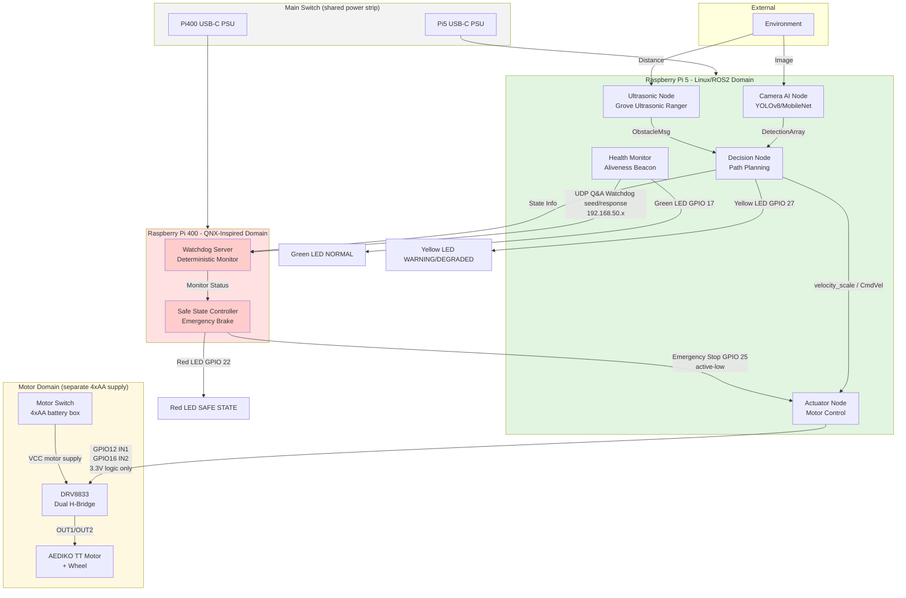
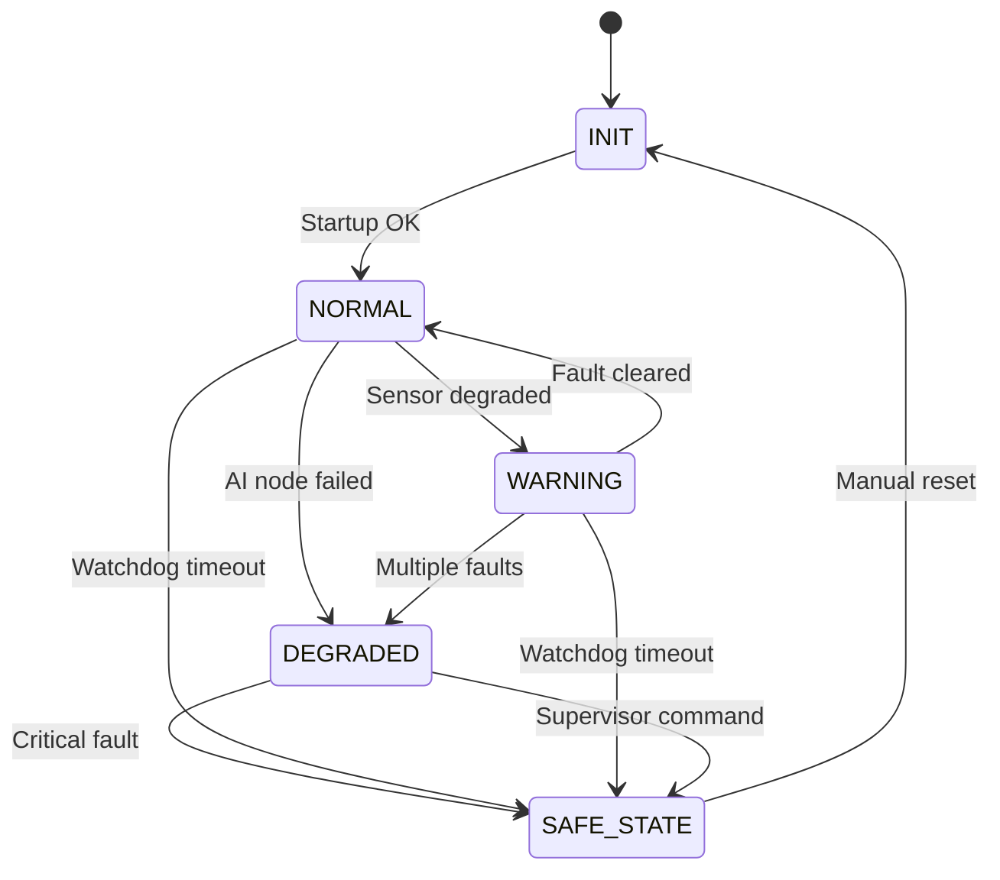

# System Architecture

> **Educational demonstrator — ASIL-B-inspired patterns only. Not ISO 26262 certified. Not production-ready.**

## Overview

This demonstrator implements a dual-processor architecture with FFI-inspired separation between the AI perception domain (Linux/ROS2) and the safety monitoring domain (QNX-inspired supervisor).

### System Power and Startup Concept

**Main Switch (shared power strip):**
Both Raspberry Pi boards are powered through the same power strip, controlled by the **Main Switch**.
When the Main Switch is ON, both Pi5 and Pi400 boot simultaneously. When OFF, both power down.

**Motor Switch (4×AA battery box):**
The DRV8833 motor driver is powered **separately** from a 4×AA battery box with its own
**Motor Switch**. The motor can only rotate if the Motor Switch is ON AND the software state
allows it. The Raspberry Pi supplies only 3.3 V logic signals to DRV8833 IN1/IN2 — never motor
supply voltage.

**Startup release criterion:**
The system enters NORMAL only after all of the following are satisfied:
1. Pi400 Q&A watchdog communication is healthy (failure_counter < 3).
2. All required ROS2 application nodes on Pi5 are alive.
3. Sensor validity checks pass (ultrasonic valid, camera optional/supplementary).

If startup criteria are not met, the system remains in SAFE_STATE. Manual `/reset` is required.

**Pi400 watchdog role:**
The Pi400 supervisor is external to the Pi5 application stack. It operates independently,
using only rule-based deterministic logic. AI perception outputs never reach the Pi400 supervisor.
On watchdog fault or startup failure, the Pi400 asserts GPIO 25 LOW (e-stop, active-low) and
illuminates the red LED via GPIO 22 — independently of Pi5 software.

## High-Level Architecture

## Component Descriptions

### Linux/ROS2 Domain (Raspberry Pi 5)

**Camera AI Node**
- Runs object detection inference (YOLOv8 or MobileNet)
- Publishes detection results on `/detections` topic
- NOT part of safety decision path (development domain)

**Ultrasonic Node**
- Reads Grove Ultrasonic Ranger via GPIO 23 (single-wire SIG protocol)
- Publishes obstacle distances on `/obstacles` topic
- Provides redundant perception for close-range obstacles (2–350 cm)

**Decision Node**
- Receives perception inputs from Camera AI and Ultrasonic nodes
- Performs path planning and generates velocity commands
- Publishes on `/cmd_vel` topic

**Actuator Node**
- Receives velocity commands (`velocity_scale`) from Decision Node
- Controls DRV8833 IN1/IN2 via GPIO 12 and GPIO 16 (3.3 V logic signals only — no motor supply on Pi GPIO)
- Enforces `velocity_scale = 0.0` (motor stop) in SAFE_STATE, INIT, and any unhandled state
- **Critical**: Accepts emergency stop from QNX supervisor (GPIO 25 active-low, polled at 100 Hz)
- Motor rotates only if: (a) system state is NORMAL or allowed WARNING/DEGRADED, AND (b) Motor Switch is ON

**Health Monitor**
- Manages I2C Q&A watchdog as I2C master (GPIO 2/3)
- Reads seed from Pi400, computes response (`seed XOR 0xA5A5A5A5`), sends within valid window
- Drives Green LED (GPIO 17) to indicate NORMAL state
- Monitors ROS2 node liveness

### QNX-Inspired Domain (Raspberry Pi 400 or Linux Fallback)

**Watchdog Server**
- Acts as UDP server (port 9001, dedicated Ethernet) — QOperates as I2C slave (address `0x40`, GPIO 2/3) — Q&A watchdog monitorA watchdog monitor
- Issues seeds, validates Pi5 responses for timing (50–100 ms window) and correctness
- Manages failure counter: +1 on bad/late/early response, −1 after 2 consecutive correct
- Triggers SAFE_STATE when failure counter reaches 3

**Safe State Controller**
- Executes safe state (emergency brake, motor disable)
- Independent of AI inference results
- Deterministic, rule-based logic only

## FFI-Inspired Measures

### Freedom from Interference (FFI-Inspired)

**Spatial Independence**
- Physically separate processors for development and safety domains
- QNX supervisor cannot be corrupted by Linux kernel panics or AI inference failures

**Temporal Independence**
- Deterministic watchdog timeout thresholds (configurable, e.g., 500ms)
- Safety decisions do not depend on AI inference timing

**Communication Independence**
- Watchdog uses I2C Q&A challenge/response (not reliant on ROS2 or shared memory)
- Emergency stop uses direct GPIO (GPIO 25 Pi400 → GPIO 25 Pi5), independent of I2C
- Shared memory region with CRC checking for state reporting (secondary channel)

**Design Independence**
- Safety logic designed and reviewed separately from AI perception
- Different programming languages/frameworks acceptable (C++ ROS2 vs C QNX)

## Safety Architecture Patterns

> Safety mechanism implementation details (watchdog protocol, state machine rules,
> thresholds, FTTI) are in **`docs/safety_mechanisms.md`**.

Three core patterns:

1. **Independent Safety Monitor** — Pi400 supervisor makes decisions based solely on watchdog
   liveness. AI outputs never reach the supervisor.
2. **Deterministic Safe State** — Rule-based StateEvaluator (C++20), no probabilistic logic.
3. **Fail-Safe Default** — GPIO 25 asserted LOW at Pi400 boot; released only after valid Q&A.

## State Machine

## Interface Boundaries

### Linux → QNX (Pi5 → Pi400)
- **I2C Q&A Watchdog** (GPIO 2/3, I2C master): Seed read + response write, 50–100 ms window
- **Shared State** (optional): System health enum + CRC via `/dev/shm/safety_state`

### QNX → Linux (Pi400 → Pi5)
- **Emergency Stop GPIO 25** (active-low): Direct wire Pi400 GPIO 25 → Pi5 GPIO 25

### Shared Visual Output
- **Red LED** (wired-OR): Pi5 GPIO 22 and Pi400 GPIO 22 both drive the red LED via 1N4148 diodes; either domain can independently assert SAFE STATE indication

See [interfaces.yaml](../requirements/interfaces.yaml) for detailed message specifications.

## Deployment Notes

### Development Setup
- Pi 5: Ubuntu 22.04 + ROS2 Humble
- Pi 400: Linux with QNX-inspired watchdog patterns (POSIX timers, deterministic scheduling)

### Future Production Considerations
- Pi 400 could run QNX RTOS with certified BSP
- ASIL-B qualification would require full process compliance (not demonstrated here)

## References

- ISO 26262:2018 Part 6 (Software), Part 9 (ASIL-oriented, safety-oriented analyses)
- IEC 61508 Functional Safety Standard
- AUTOSAR Adaptive Platform specifications
