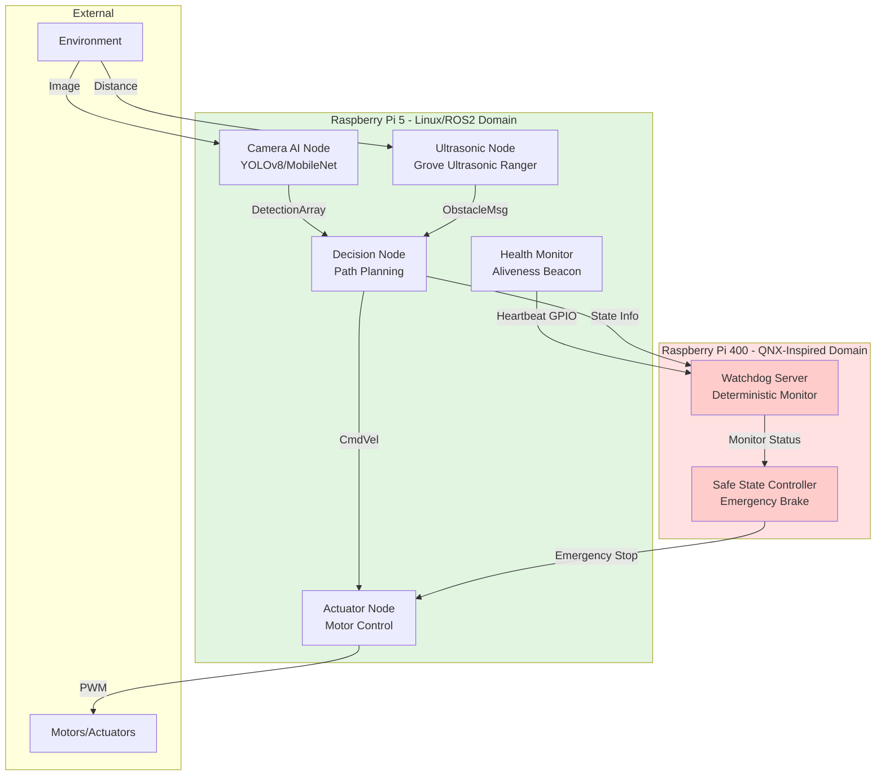
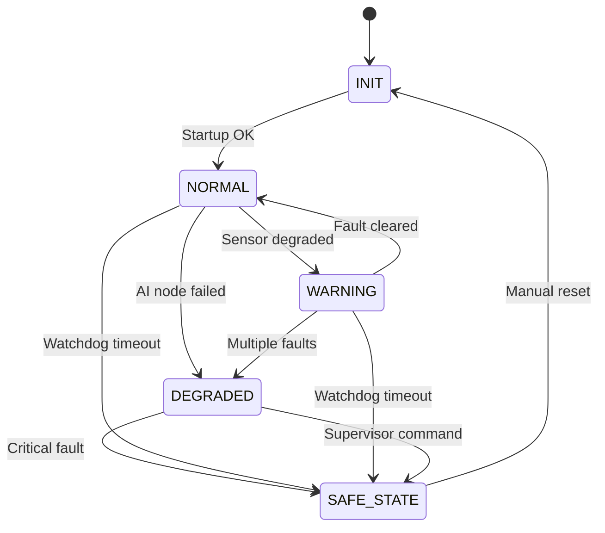

# System Architecture

## Overview

This demonstrator implements a dual-processor architecture with FFI-inspired separation between the AI perception domain (Linux/ROS2) and the safety monitoring domain (QNX-inspired supervisor).

## High-Level Architecture

## Component Descriptions

### Linux/ROS2 Domain (Raspberry Pi 5)

**Camera AI Node**
- Runs object detection inference (YOLOv8 or MobileNet)
- Publishes detection results on `/detections` topic
- NOT part of safety decision path (development domain)

**Ultrasonic Node**
- Reads Grove Ultrasonic Ranger via GPIO 23 (single-wire SIG protocol)
- Publishes obstacle distances on `/obstacles` topic
- Provides redundant perception for close-range obstacles (2–350 cm)

**Decision Node**
- Receives perception inputs from Camera AI and Ultrasonic nodes
- Performs path planning and generates velocity commands
- Publishes on `/cmd_vel` topic

**Actuator Node**
- Receives velocity commands from Decision Node
- Controls motor PWM signals
- **Critical**: Accepts emergency stop from QNX supervisor

**Health Monitor**
- Generates periodic heartbeat signal via GPIO
- Monitors ROS2 node liveness
- Reports system state to supervisor

### QNX-Inspired Domain (Raspberry Pi 400 or Linux Fallback)

**Watchdog Server**
- Monitors heartbeat signal from Linux domain
- Applies deterministic safety rules (timeout thresholds)
- Triggers safe state transition on failure detection

**Safe State Controller**
- Executes safe state (emergency brake, motor disable)
- Independent of AI inference results
- Deterministic, rule-based logic only

## FFI-Inspired Measures

### Freedom from Interference (FFI-Inspired)

**Spatial Independence**
- Physically separate processors for development and safety domains
- QNX supervisor cannot be corrupted by Linux kernel panics or AI inference failures

**Temporal Independence**
- Deterministic watchdog timeout thresholds (configurable, e.g., 500ms)
- Safety decisions do not depend on AI inference timing

**Communication Independence**
- Watchdog uses simple GPIO heartbeat (not complex IPC)
- Fallback: Shared memory region with CRC checking

**Design Independence**
- Safety logic designed and reviewed separately from AI perception
- Different programming languages/frameworks acceptable (C++ ROS2 vs C QNX)

## Safety Architecture Patterns

### 1. Independent Safety Monitor
The QNX supervisor does NOT process AI outputs. It only monitors:
- Aliveness (heartbeat presence)
- Timing (heartbeat period within bounds)
- State consistency (system health indicators)

### 2. Deterministic Safe State
When faults are detected, the supervisor transitions to a predefined safe state:
- **Immediate**: Motor disable via GPIO override
- **Deterministic**: No AI decision-making in safety path

### 3. Fail-Safe Design
System defaults to safe state (motors disabled) on:
- Watchdog timeout
- Health monitor failure
- Communication loss

## State Machine

## Interface Boundaries

### Linux → QNX
- **GPIO Heartbeat**: Periodic pulse (e.g., 10 Hz)
- **Shared State** (optional): System health enum + CRC

### QNX → Linux
- **Emergency Stop GPIO**: Active-low signal to actuator node

See [interfaces.yaml](../requirements/interfaces.yaml) for detailed message specifications.

## Deployment Notes

### Development Setup
- Pi 5: Ubuntu 22.04 + ROS2 Humble
- Pi 400: Linux with QNX-inspired watchdog patterns (POSIX timers, deterministic scheduling)

### Future Production Considerations
- Pi 400 could run QNX RTOS with certified BSP
- ASIL-B qualification would require full process compliance (not demonstrated here)

## References

- ISO 26262:2018 Part 6 (Software), Part 9 (ASIL-oriented, safety-oriented analyses)
- IEC 61508 Functional Safety Standard
- AUTOSAR Adaptive Platform specifications
