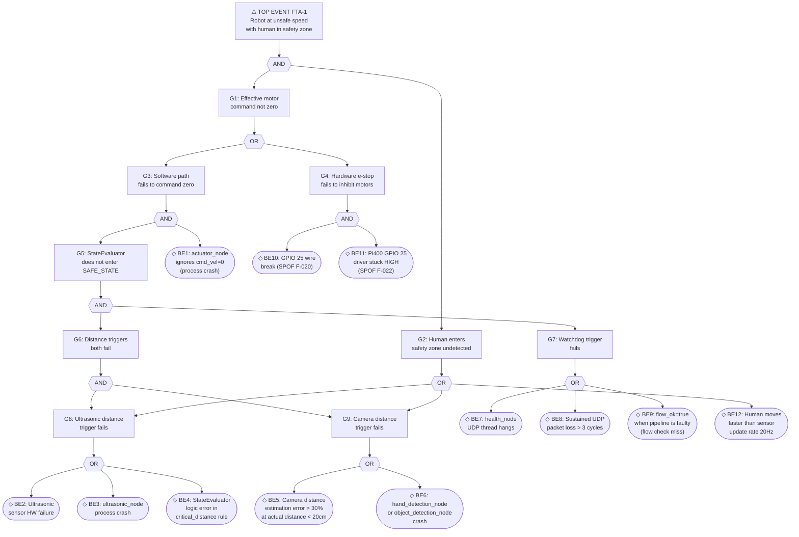
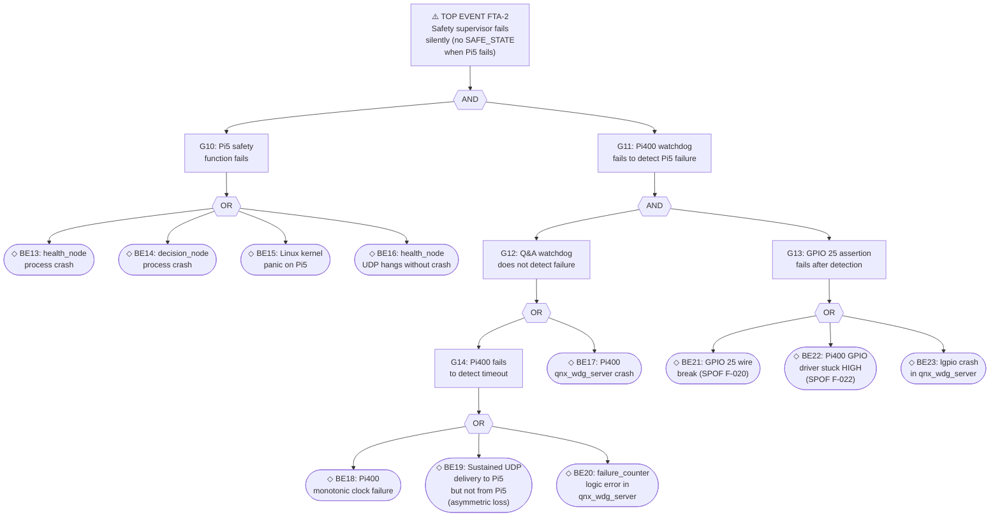

# Fault Tree Analysis (FTA)

**Document**: FTA-001
**Project**: Safety-Supervised Edge AI Demonstrator
**Standard reference**: ISO 26262-9:2018 Clause 7 (Fault tree analysis)
**Date**: 2026-05-12
**Author**: Yunpeng Yang
**Status**: COMPLETE — educational demonstrator scope

> **Disclaimer**: This FTA is performed using ISO 26262-inspired methodology for an
> educational demonstrator. It is NOT a certified FTA. No quantitative failure rates
> (FIT) are available for the hardware platform. Qualitative analysis only.
> A production system requires a quantitative FTA with certified failure rate data.

---

## 1. Scope and Method

FTA is a **top-down, deductive** analysis that starts from an undesired top-level event
(system hazard) and systematically decomposes it into combinations of lower-level
failures using Boolean logic gates.

**Gate types used:**

| Symbol | Gate | Meaning |
|---|---|---|
| OR | OR gate | Any single input causes the output |
| AND | AND gate | All inputs must occur simultaneously |
| ◇ | Basic event | Lowest-level failure; no further decomposition |
| ○ | Undeveloped event | Not further analysed (out of scope or data unavailable) |

**Top-level events analysed** (from HARA.md):

| FTA | Top event | Source hazard | ASIL |
|---|---|---|---|
| FTA-1 | Robot operates at unsafe speed with human in safety zone | HAZ-001 | B |
| FTA-2 | Safety supervisor fails to detect Pi5 failure | HAZ-004 | A |

---

## 2. FTA-1 — Unsafe Speed with Human in Safety Zone

### 2.1 Fault Tree Diagram



### 2.2 Minimal Cut Sets (MCS)

A minimal cut set is the smallest combination of basic events whose simultaneous
occurrence causes the top event.

**Single-event cut sets (most critical — SPOF):**

| MCS | Basic events | Comment |
|---|---|---|
| MCS-1 | {BE10 AND BE11} | Both GPIO 25 SPOFs fail simultaneously — no software path needed |

**Two-event cut sets:**

| MCS | Basic events | Comment |
|---|---|---|
| MCS-2 | {BE4, BE9} | StateEvaluator logic error + flow check miss |
| MCS-3 | {BE2 OR BE3, BE5 OR BE6} | Both distance sensors fail + watchdog OK |
| MCS-4 | {BE7 OR BE8, BE2 OR BE3, BE5 OR BE6} | Watchdog fails + both distance sensors fail |

**Key observation**: The hardware e-stop (GPIO 25) is the **most critical single path**.
Its two SPOFs (F-020 and F-022) are the only route to system hazard without requiring
multiple software failures. This confirms the FMEA finding that F-020 and F-022 must
be resolved for production.

### 2.3 Independence Analysis

The two main mitigation paths are:

| Path | Implementation | Independence |
|---|---|---|
| Software (StateEvaluator) | Pi5 decision_node C++20 | Depends on Pi5 CPU, OS, ROS2 |
| Hardware (GPIO 25 e-stop) | Pi400 GPIO direct wire | **Independent of Pi5 software stack** |

The AND gate at G1 (software path AND hardware path must both fail) provides the
key safety argument: a Pi5 software failure alone cannot cause the top event if
GPIO 25 is functioning. The two paths share only the power supply as a common cause.

**Common cause failure (CCF) concern**: If the dedicated Ethernet link fails AND
the power supply has a transient, both paths could be simultaneously degraded.
Mitigation: GPIO 25 is a direct wire, not network-dependent.

---

## 3. FTA-2 — Silent Safety Supervisor Failure

### 3.1 Fault Tree Diagram



### 3.2 Minimal Cut Sets

**Single-event cut sets:**

None — detection (G12) and assertion (G13) are in series (AND gate), requiring at
least two events.

**Two-event cut sets:**

| MCS | Basic events | Comment |
|---|---|---|
| MCS-5 | {BE13 OR BE14 OR BE15} AND {BE17} | Pi5 fails AND Pi400 server crashes simultaneously |
| MCS-6 | {BE16} AND {BE18 OR BE19} | health_node hangs AND Pi400 cannot measure timeout |
| MCS-7 | {any Pi5 failure} AND {BE21} | Pi5 fails AND GPIO 25 wire break |
| MCS-8 | {any Pi5 failure} AND {BE22} | Pi5 fails AND GPIO 25 driver stuck HIGH |

**Key observation**: MCS-7 and MCS-8 involve the same GPIO 25 SPOFs identified
in FTA-1. This confirms that resolving F-020 and F-022 improves both FTA-1 and FTA-2.

### 3.3 Independence Analysis

The Q&A watchdog architecture provides independence at multiple levels:

| Level | Independence measure | Shared resource |
|---|---|---|
| Computation | Pi5 vs Pi400 (separate processors) | Power supply |
| Memory | Separate address spaces (MMU + physical) | None |
| Communication | UDP over dedicated Ethernet | Ethernet switch (if any) |
| Timing | Pi400 uses its own monotonic clock | None |
| GPIO assertion | Direct wire, no network dependency | Power supply |

**Flow check gate** (SM-7) catches the case where Pi5 nodes fail silently without
affecting the health_node process: pipeline nodes' missed deadlines → WDG withheld
→ Pi400 detects → SAFE_STATE.

---

## 4. Cross-Cutting Analysis

### 4.1 Common cause failures

| CCF scenario | Affected paths | Mitigation |
|---|---|---|
| Power supply failure | Both Pi5 and Pi400 | Motor controllers lose power → fail-safe stop |
| Ethernet switch failure | UDP watchdog | Fail-safe: timeout → SAFE_STATE; GPIO 25 independent |
| Physical cable damage (GPIO 25) | Hardware e-stop | SPOF — no mitigation in demonstrator |
| Thermal runaway (shared enclosure) | Both processors | Not mitigated; out of demonstrator scope |

### 4.2 Dependent failure pairs (beta factor pairs)

In quantitative FTA, a beta factor (β) represents the fraction of failures
that are common cause. The following pairs would require beta analysis in
production:

| Pair | Dependency | Qualitative β estimate |
|---|---|---|
| Pi5 kernel panic + Pi400 crash | Shared power supply transient | Low (separate boards, different timing) |
| GPIO 25 wire break + UDP loss | Physical damage event | Medium (cable bundle) |
| health_node hang + flow check failure | Same Python process | Low (flow check in same process) |

### 4.3 Safety barrier effectiveness

```
Hazard source          Safety barrier 1        Safety barrier 2        Residual risk
─────────────          ─────────────────        ─────────────────        ─────────────
Ultrasonic failure  →  Camera distance       →  Watchdog (flow check) → DEGRADED mode
Camera failure      →  Ultrasonic distance   →  Watchdog (flow check) → DEGRADED mode
Both sensors fail   →  (none)                →  Watchdog detects       → SAFE_STATE
Pi5 crash           →  Watchdog Q&A          →  GPIO 25 assertion      → SAFE_STATE
Pi400 crash         →  GPIO 25 last state    →  (boot = LOW = safe)    → Safe default
GPIO 25 broken      →  Software SAFE_STATE   →  (no HW backup)         → SPOF gap
```

---

## 5. Cut Set Summary and Risk Ranking

| MCS | Events | Probability (qualitative) | Risk |
|---|---|---|---|
| MCS-1 | GPIO 25 wire break AND driver stuck HIGH | Low (requires two HW faults) | High (SPOF pair) |
| MCS-7/8 | Pi5 failure AND GPIO 25 SPOF | Low-Medium | High (no redundancy) |
| MCS-2 | StateEvaluator logic error AND flow check miss | Very low (gtest coverage) | Medium |
| MCS-4 | Watchdog fail AND both sensors fail | Very low (independent) | Medium |
| MCS-5 | Pi5 crash AND Pi400 crash simultaneously | Very low | Low |

**Overall qualitative FTA conclusion**: The dominant failure paths both involve the GPIO 25
SPOFs (F-020 and F-022). All other MCS require simultaneous failure of independently
designed and verified components — their probability is substantially lower.

---

## 6. FTA Conclusions and Recommendations

### 6.1 Critical findings

1. **GPIO 25 is the weakest point** — the only minimal cut sets with qualitatively
   significant probability involve either the wire break (F-020) or the driver stuck
   HIGH (F-022). Both must be resolved for production.

2. **Dual-path architecture works** — all other MCS require AND combinations of
   independently verified software components, making simultaneous failure improbable.

3. **Flow check gate is effective** — it catches the specific failure mode where
   Pi5 nodes fail silently, closing a gap that the Q&A watchdog alone would miss
   (BE16: health_node hangs but doesn't crash).

4. **Camera distance fusion improves coverage** — adding camera_hand_critical as
   a SAFE_STATE trigger (SYS-SAFE-012) reduces the probability of MCS-3 (both distance
   triggers fail simultaneously).

### 6.2 Production recommendations

| Priority | Action | Addresses |
|---|---|---|
| P1 — Critical | Add redundant GPIO 25 channel or periodic self-test | MCS-1, MCS-7, MCS-8 |
| P2 — High | Replace Pi400 software timer with hardware watchdog IC | BE18 |
| P3 — Medium | Add GPIO 25 wire continuity monitoring | F-020 |
| P4 — Medium | Add Pi400 GPIO 25 output monitoring (readback) | F-022 |
| P5 — Low | Harden flow check: run in separate process from health_node | BE16 |

---

## 7. References

- ISO 26262-9:2018 Clause 7 (Fault tree analysis)
- IEC 61025:2006 (Fault tree analysis — FTA)
- `docs/safety_analysis/HARA.md` — top-level hazards and ASIL
- `docs/safety_analysis/FMEA.md` — basic event failure modes
- `docs/safety_mechanisms.md` — implementation details
- `docs/fault_injection_report.md` — fault injection evidence

---

*Quantitative FTA would require FIT rates per IEC 62380 or SN 29500 for each basic event.*
*This analysis is qualitative and for educational/portfolio purposes.*
