# Safety-Supervised Edge AI Demo — Architecture Diagrams

**Single source of truth for all architecture diagrams.**
Mermaid notation — renders in GitHub and VS Code Markdown Preview.

> Educational demonstrator — not ISO 26262 certified.
> ASIL-B-inspired patterns. FFI-inspired architectural measures. No LLM/cloud AI in runtime safety path.

---

## Static Diagrams

### 1. Block Definition Diagram (BDD) — Hardware Blocks

Maps SysML `part def` blocks and their attributes.
Shows system composition: `SafetySupervisedEdgeAIDemo` is composed of five hardware blocks.

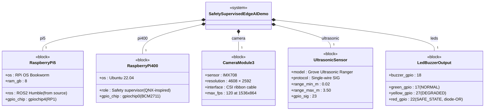

---

### 2. Block Definition Diagram (BDD) — Software Nodes

Maps ROS2 nodes (Linux domain) and supervisor components (QNX domain).

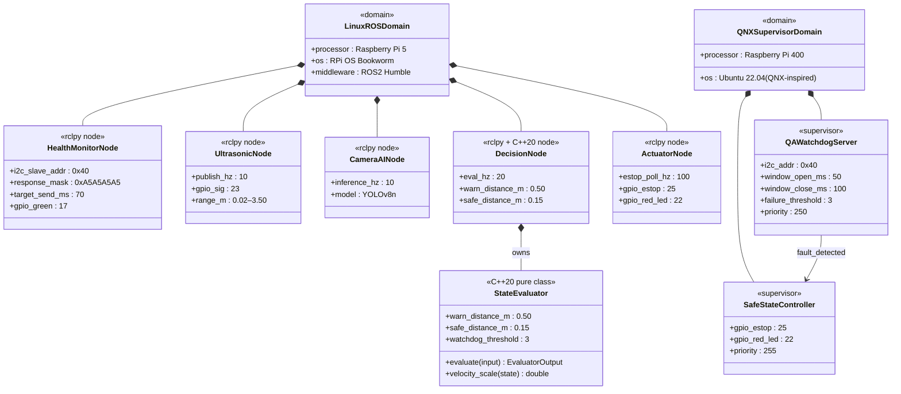

---

### 3. Internal Block Diagram (IBD) — Inter-Processor Connections

Maps SysML `connect` statements and port flows between domains.

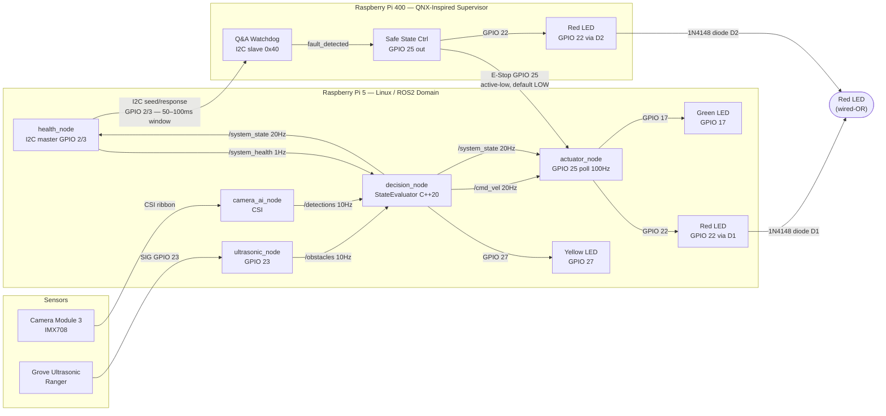

---

### 4. Package Diagram

Shows domain separation — the key FFI-inspired architectural measure.

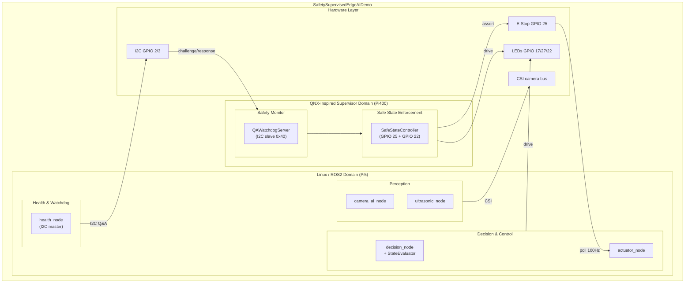

---

### 5. Requirements Diagram

Maps key safety requirements to implementing components and verification methods.

```mermaid
requirementDiagram

    requirement SYS_SAFE_007 {
        id: SYS_SAFE_007
        text: State machine with 5 states INIT NORMAL WARNING DEGRADED SAFE_STATE
        risk: High
        verifymethod: Test
    }

    requirement SYS_SAFE_004 {
        id: SYS_SAFE_004
        text: QA watchdog valid response window 50 to 100ms
        risk: High
        verifymethod: Test
    }

    requirement SYS_SAFE_004a {
        id: SYS_SAFE_004a
        text: failure counter threshold 3 triggers SAFE STATE
        risk: High
        verifymethod: Test
    }

    requirement SYS_SAFE_006 {
        id: SYS_SAFE_006
        text: Safe state latency less than 150ms from fault to motor disable
        risk: High
        verifymethod: Test
    }

    requirement SYS_SAFE_010 {
        id: SYS_SAFE_010
        text: Red LED assertable independently by Pi5 and Pi400
        risk: Medium
        verifymethod: Inspection
    }

    requirement SYS_SAFE_001 {
        id: SYS_SAFE_001
        text: AI inference shall not influence runtime safety decisions
        risk: High
        verifymethod: Analysis
    }

    element stateEvaluator {
        type: C++20 class
        docref: src/decision_node/src/state_evaluator.cpp
    }

    element healthNode {
        type: rclpy node
        docref: src/health_node/health_node/health_node.py
    }

    element actuatorNode {
        type: rclpy node
        docref: src/actuator_node/actuator_node/actuator_node.py
    }

    element qaWatchdog {
        type: supervisor component
        docref: pi400_supervisor/qnx_wdg_server
    }

    element diodeOrCircuit {
        type: hardware circuit
        docref: hardware/wiring.md
    }

    stateEvaluator - satisfies -> SYS_SAFE_007
    stateEvaluator - satisfies -> SYS_SAFE_006
    stateEvaluator - satisfies -> SYS_SAFE_001
    healthNode - satisfies -> SYS_SAFE_004
    qaWatchdog - satisfies -> SYS_SAFE_004a
    actuatorNode - satisfies -> SYS_SAFE_006
    diodeOrCircuit - satisfies -> SYS_SAFE_010
```

---

## Dynamic Diagrams

### 6. State Machine Diagram

Software state machine implemented in `StateEvaluator` (C++20), evaluated at 20 Hz.
Priority rules enforced top-down. GPIO 25 e-stop is an independent hardware layer below this.

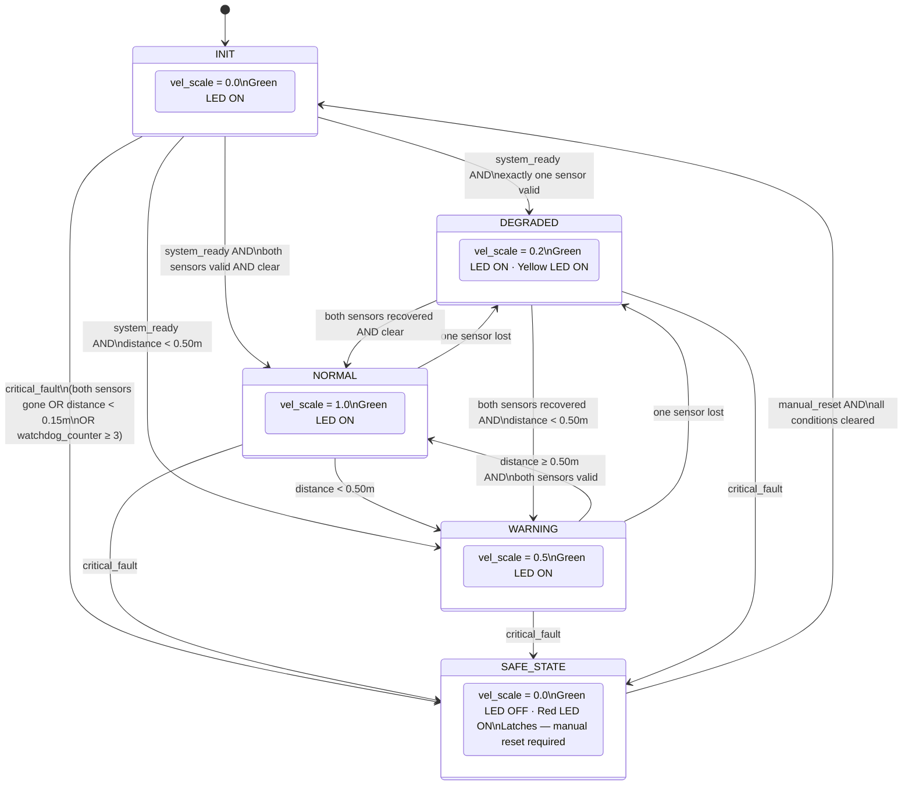

---

### 7. Sequence Diagram — System Startup (M3)

Verified on hardware 2026-05-08. Camera is a placeholder in M3 → system starts in DEGRADED.

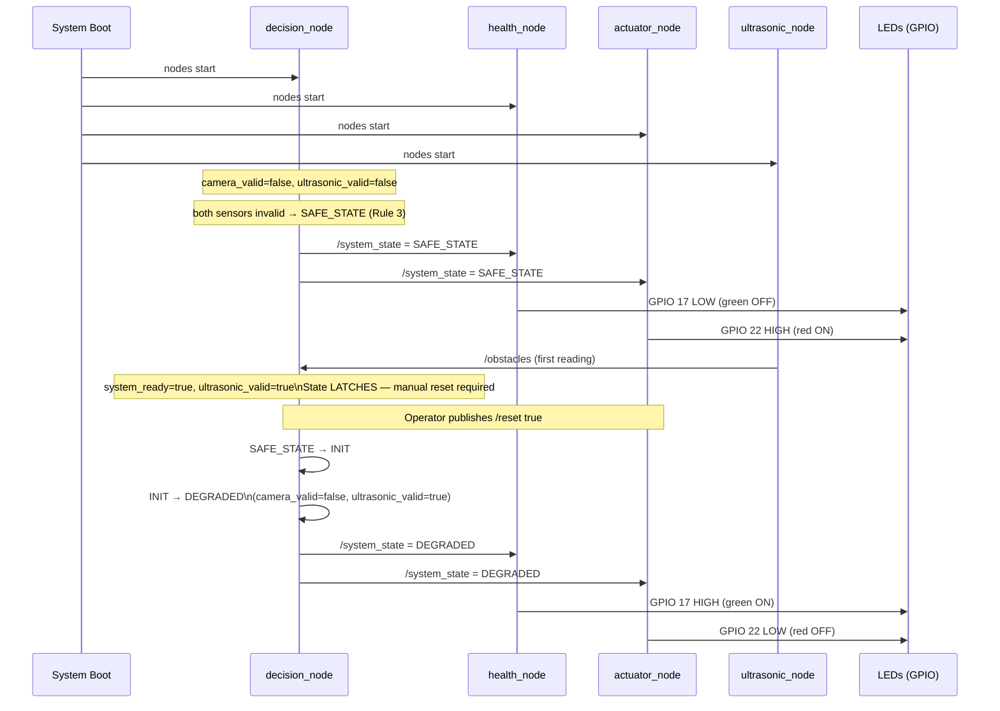

---

### 8. Sequence Diagram — I2C Q&A Watchdog Protocol

Pi5 is I2C master. Pi400 is I2C slave at address 0x40. Not yet active in M3 — Pi400 slave deferred to M5.

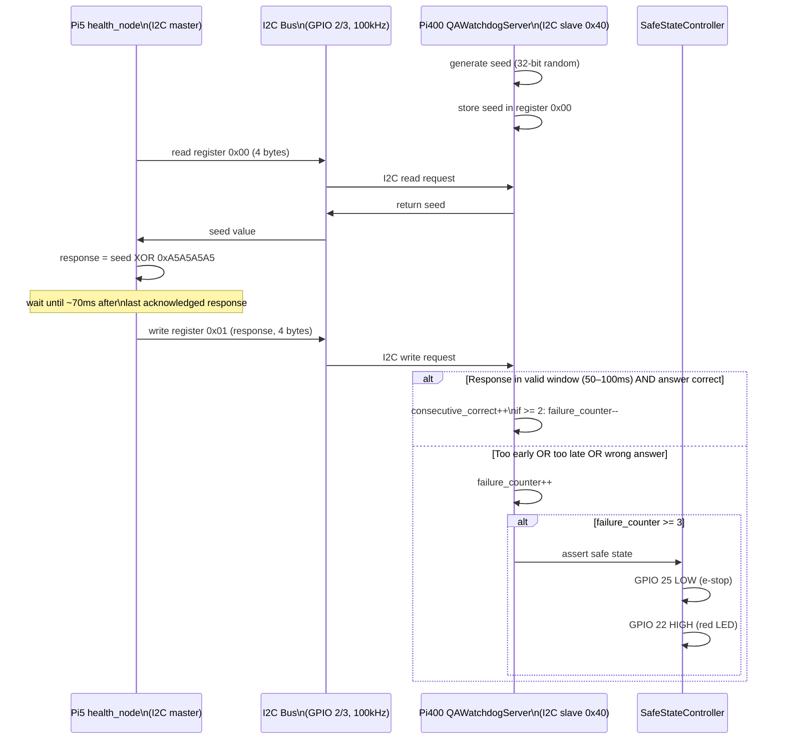

---

### 9. Sequence Diagram — Obstacle Detection → SAFE_STATE → Reset

Verified on hardware 2026-05-08.

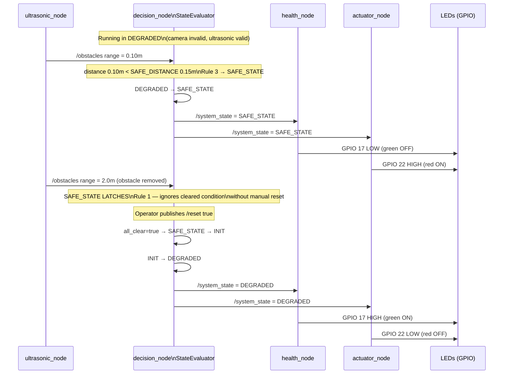

---

### 10. Sequence Diagram — Hardware E-Stop (Independent Safety Layer)

GPIO 25 e-stop bypasses the software state machine entirely.
This is the key FFI measure: Pi400 can stop motors regardless of Pi5 software state.

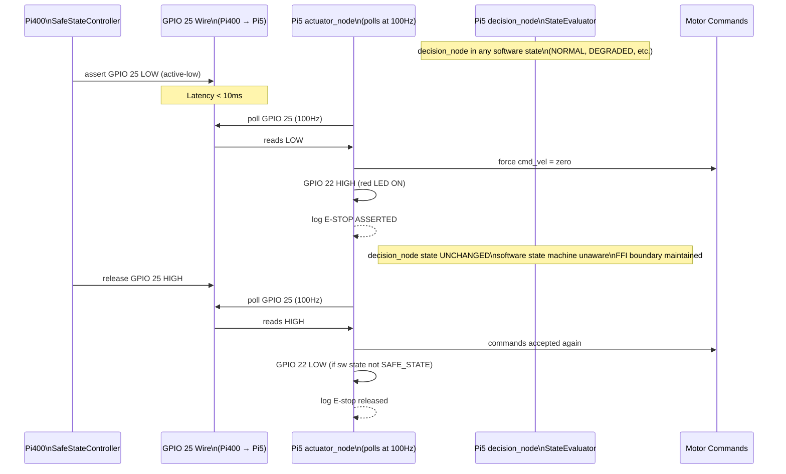

---

### 11. Activity Diagram — StateEvaluator Priority Rules

Maps the C++20 `StateEvaluator::evaluate()` logic. Implemented in
`pi5_linux/ros2_ws/src/decision_node/src/state_evaluator.cpp`.

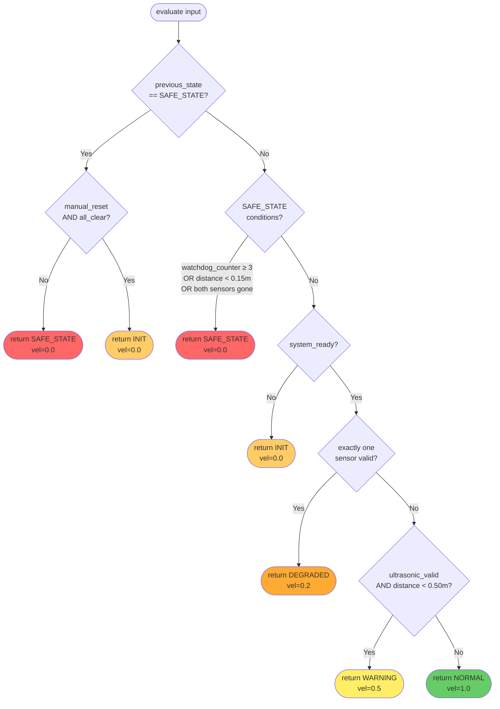

---

*Diagrams maintained in this file — single source of truth.*
*Rendered by Mermaid — GitHub and VS Code Markdown Preview.*
*Last updated: 2026-05-08*
