# Safety-Supervised Edge AI Demo — Architecture Diagrams

**Single source of truth for all architecture diagrams.**
Mermaid notation — renders in GitHub and VS Code Markdown Preview.
Last updated: 2026-05-11 (reflects final system M0–M8).

> Educational demonstrator — not ISO 26262 certified.
> ASIL-B-inspired patterns. FFI-inspired architectural measures. No LLM/cloud AI in runtime safety path.

---

## Static Diagrams

### 1. Block Definition Diagram (BDD) — Hardware Blocks

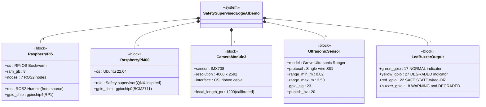

---

### 2. Block Definition Diagram (BDD) — Software Nodes

M7: camera_ai_node split into two MMU-isolated processes for spatial FFI.

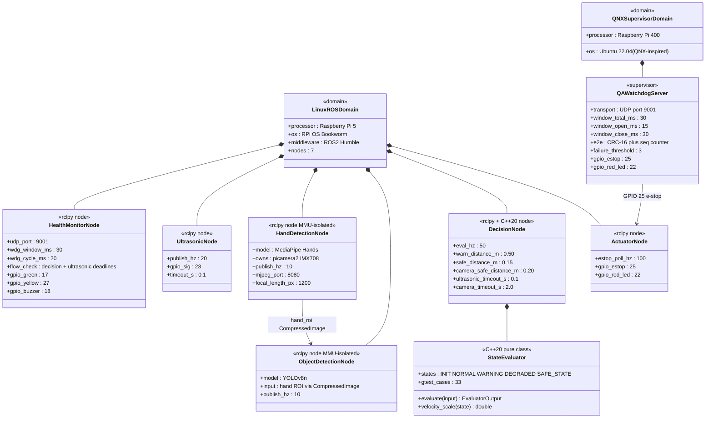

---

### 3. Internal Block Diagram (IBD) — Inter-Processor Connections

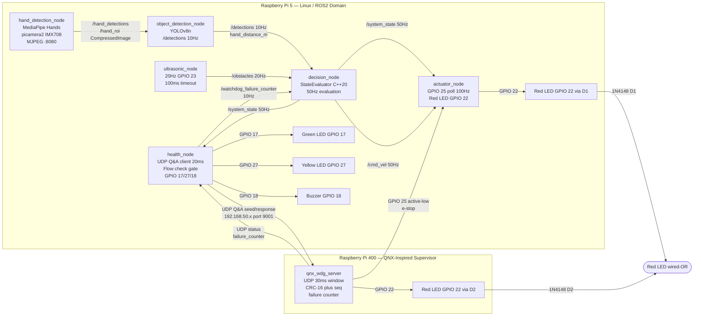

---

### 4. Package Diagram — Domain Separation

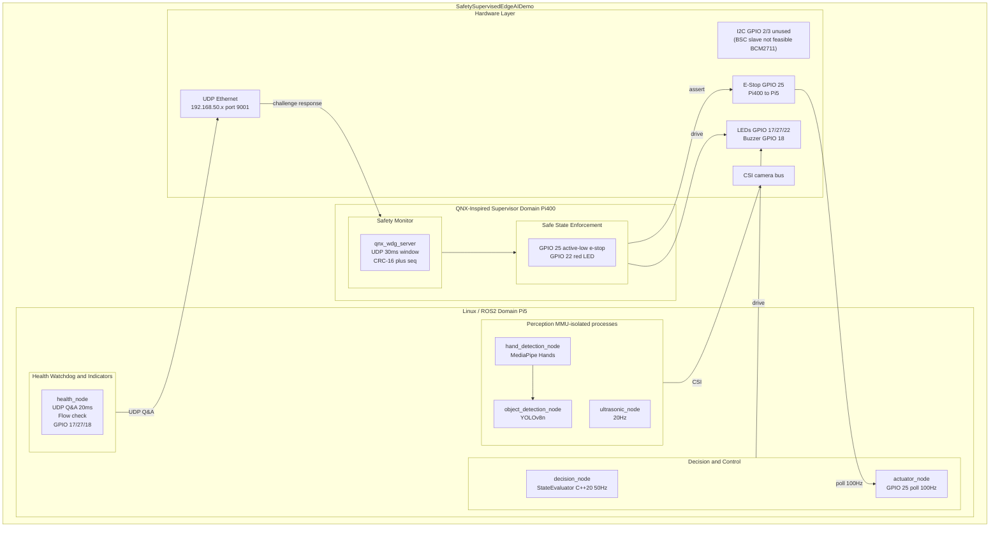

---

### 5. Requirements Diagram

```mermaid
requirementDiagram

    requirement SYS_SAFE_007 {
        id: SYS_SAFE_007
        text: State machine 5 states INIT NORMAL WARNING DEGRADED SAFE_STATE
        risk: High
        verifymethod: Test
    }

    requirement SYS_SAFE_004 {
        id: SYS_SAFE_004
        text: QA watchdog window 30ms total 15ms closed 15ms open
        risk: High
        verifymethod: Test
    }

    requirement SYS_SAFE_006 {
        id: SYS_SAFE_006
        text: Safe state latency less than 150ms from fault to motor disable
        risk: High
        verifymethod: Test
    }

    requirement SYS_SAFE_011 {
        id: SYS_SAFE_011
        text: Proximity FTTI 100ms ultrasonic 20Hz plus decision 50Hz
        risk: High
        verifymethod: Test
    }

    requirement SYS_SAFE_012 {
        id: SYS_SAFE_012
        text: Camera hand distance less than 20cm triggers SAFE_STATE
        risk: High
        verifymethod: Test
    }

    requirement SYS_SAFE_001 {
        id: SYS_SAFE_001
        text: AI inference shall not influence runtime safety decisions
        risk: High
        verifymethod: Analysis
    }

    element stateEvaluator {
        type: C++20 pure class
        docref: src/decision_node/src/state_evaluator.cpp
    }

    element healthNode {
        type: rclpy node
        docref: src/health_node/health_node/health_node.py
    }

    element qaWatchdog {
        type: supervisor
        docref: pi400_supervisor/scripts/qnx_wdg_server.py
    }

    element handDetection {
        type: rclpy node
        docref: src/hand_detection_node
    }

    stateEvaluator - satisfies -> SYS_SAFE_007
    stateEvaluator - satisfies -> SYS_SAFE_006
    stateEvaluator - satisfies -> SYS_SAFE_011
    stateEvaluator - satisfies -> SYS_SAFE_012
    stateEvaluator - satisfies -> SYS_SAFE_001
    healthNode - satisfies -> SYS_SAFE_004
    qaWatchdog - satisfies -> SYS_SAFE_006
    handDetection - satisfies -> SYS_SAFE_012
```

---

## Dynamic Diagrams

### 6. State Machine Diagram

Evaluated at 50 Hz by StateEvaluator C++20. SAFE_STATE latches — manual reset required.
Buzzer: ON in WARNING and DEGRADED. Yellow LED: ON in DEGRADED only.

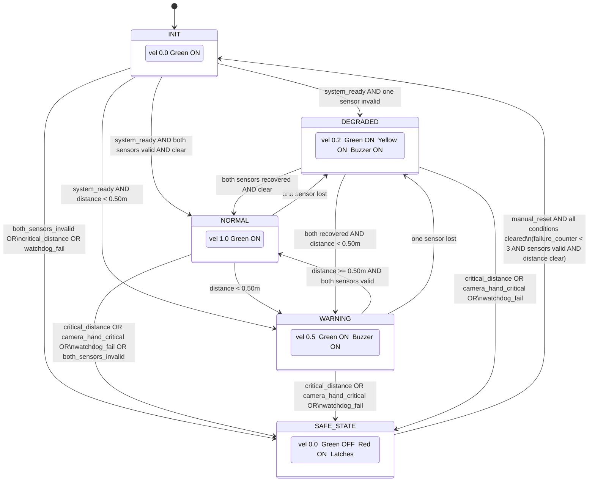

---

### 7. Sequence Diagram — System Startup

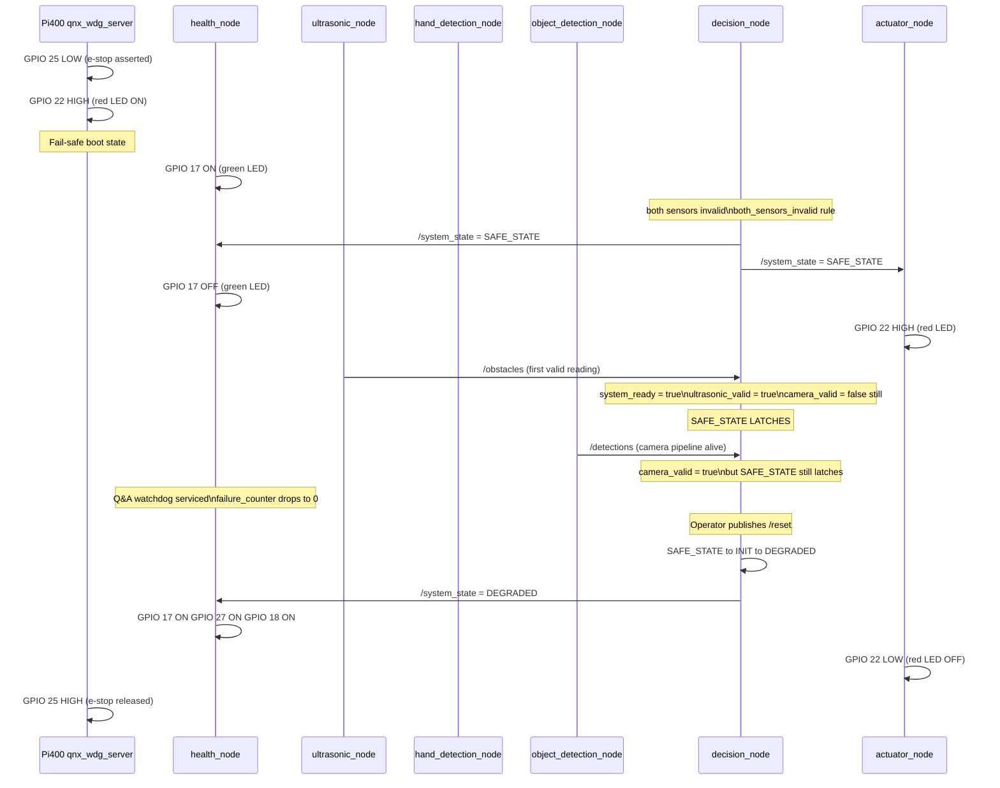

---

### 8. Sequence Diagram — UDP Q&A Watchdog Protocol

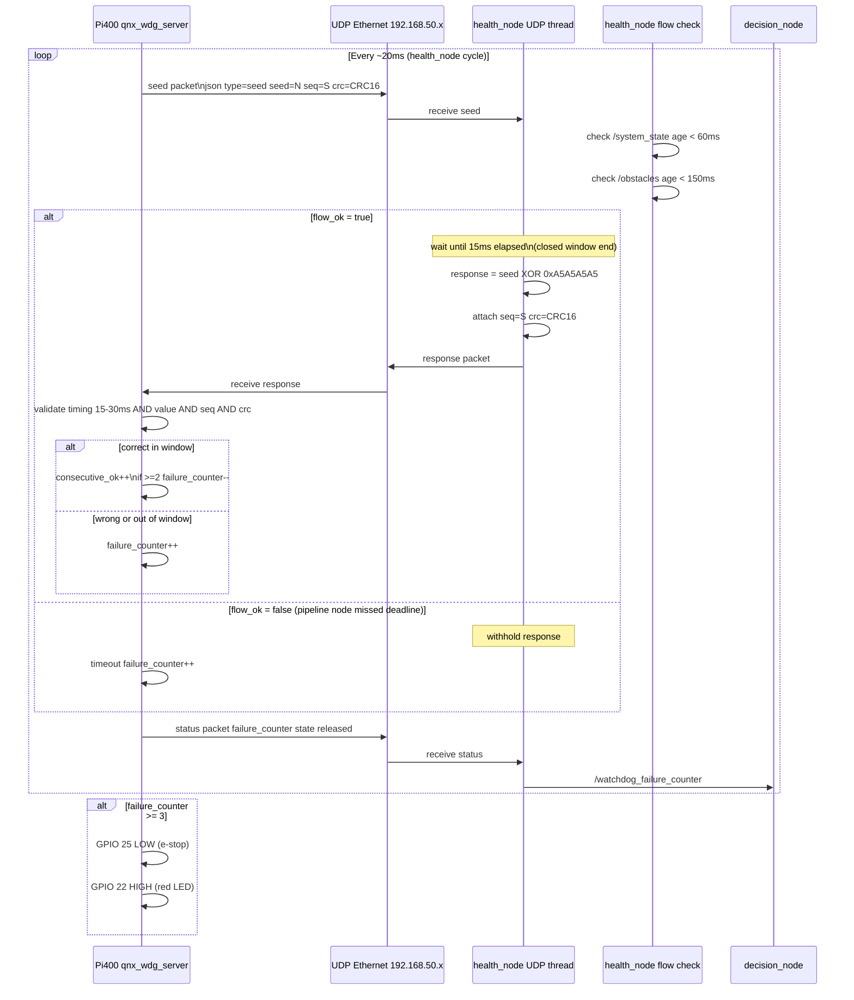

---

### 9. Sequence Diagram — Obstacle Detection and SAFE_STATE

Both sensor paths (ultrasonic distance + camera hand distance) can independently trigger.

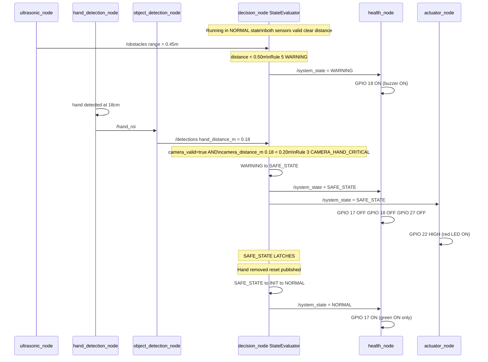

---

### 10. Sequence Diagram — Hardware E-Stop (Independent Safety Layer)

GPIO 25 path is independent of decision_node and StateEvaluator (FFI boundary).

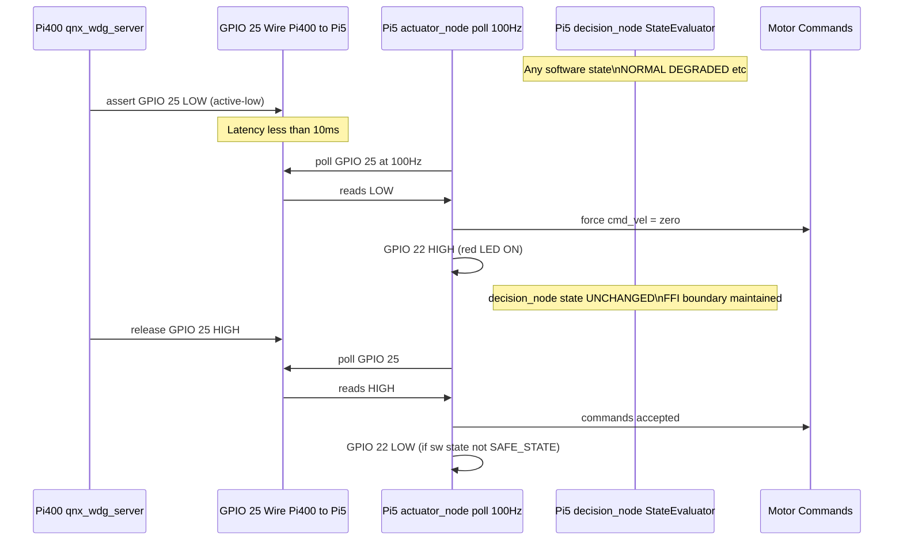

---

### 11. Activity Diagram — StateEvaluator Priority Rules

C++20 pure function in `src/decision_node/src/state_evaluator.cpp`. 33 gtest cases.

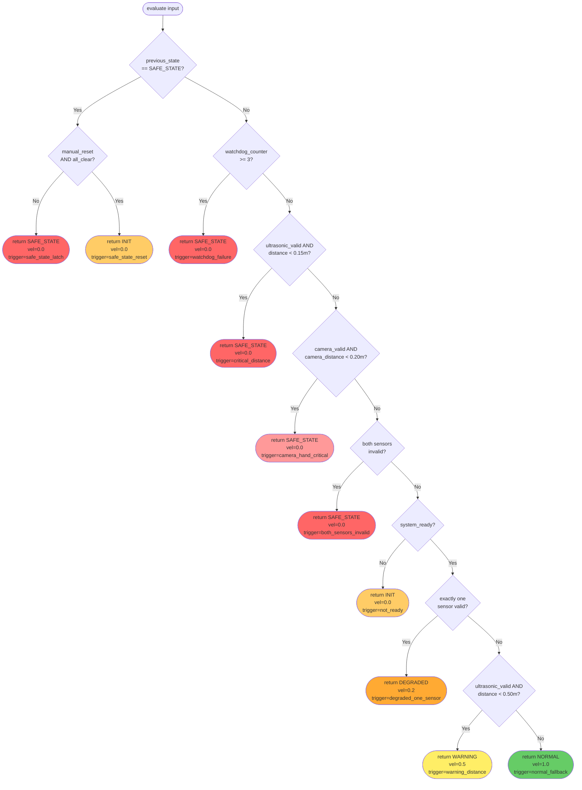

---

*Diagrams maintained in this file — single source of truth.*
*Rendered by Mermaid — GitHub and VS Code Markdown Preview.*
*Last updated: 2026-05-11*
